# SSH Brute Force Detection Lab with Splunk

## Project Overview

This project is a beginner-friendly SOC detection engineering lab focused on detecting SSH brute-force activity using Splunk Enterprise.

The lab simulates failed SSH login attempts from a Kali Linux machine against an Ubuntu machine. Ubuntu authentication logs are collected in Splunk, searched using SPL, and used to create a detection query, scheduled alert, and monitoring dashboard.

This project was built in a safe local virtual lab environment for learning and portfolio development.

---

## Lab Objective

The main goal of this project is to detect repeated failed SSH login attempts from the same source IP address within a short time window.

Repeated failed SSH logins can indicate password guessing, brute-force attempts, or unauthorized access attempts.

---

## Lab Architecture

```text
Kali Linux VM  --->  Ubuntu VM  --->  Splunk Enterprise
 Attacker            SSH Target       SIEM / Detection Platform
```

| Machine           | Role                      | Purpose                                                         |
| ----------------- | ------------------------- | --------------------------------------------------------------- |
| Kali Linux        | Attack simulation machine | Used to generate failed SSH login attempts                      |
| Ubuntu            | SSH target and log source | Stores authentication logs in `/var/log/auth.log`               |
| Splunk Enterprise | SIEM platform             | Collects logs, runs SPL searches, creates alerts and dashboards |

---

## Tools Used

* Kali Linux
* Ubuntu Linux
* VMware
* OpenSSH Server
* Splunk Enterprise 10.4.0
* SPL: Search Processing Language
* Linux authentication logs: `/var/log/auth.log`

---

## Attack Simulation

Failed SSH login attempts were generated from Kali Linux using the `ssh` command:

```bash
ssh tharindi@172.20.10.5
```

Wrong passwords were entered multiple times to create failed authentication events in Ubuntu logs.

Example log evidence:

```text
Failed password for tharindi from 172.20.10.3
```

---

## Log Source

The main log source used in this project was:

```text
/var/log/auth.log
```

Splunk was configured to monitor this file and store the events inside a custom index:

```text
linux_auth
```

---

## Detection Logic

The detection identifies repeated failed SSH login attempts from the same source IP address within a 5-minute time window.

### Detection Rule

```text
If one source IP has 3 or more failed SSH login attempts within 5 minutes, trigger an alert.
```

For this lab, the threshold was set to `3` because the attack was simulated in a small test environment.

---

## Main Splunk Detection Query

```spl
index=linux_auth "Failed password"
| rex "Failed password for (invalid user )?(?<username>\S+) from (?<src_ip>\d+\.\d+\.\d+\.\d+)"
| bin _time span=5m
| stats count as failed_attempts values(username) as usernames by _time src_ip
| where failed_attempts >= 3
| sort - failed_attempts
```

### Query Explanation

| SPL Part                             | Purpose                                       |
| ------------------------------------ | --------------------------------------------- |
| `index=linux_auth "Failed password"` | Searches failed SSH login events              |
| `rex`                                | Extracts username and source IP from raw logs |
| `bin _time span=5m`                  | Groups events into 5-minute time windows      |
| `stats count`                        | Counts failed attempts per source IP          |
| `where failed_attempts >= 3`         | Detects suspicious repeated failures          |
| `sort - failed_attempts`             | Shows highest failed attempts first           |

---

## Alert Configuration

A scheduled Splunk alert was created using the detection query.

| Setting           | Value                               |
| ----------------- | ----------------------------------- |
| Alert Name        | SSH Brute Force Detection           |
| Alert Type        | Scheduled                           |
| Schedule          | Every 5 minutes                     |
| Cron Expression   | `*/5 * * * *`                       |
| Time Range        | Last 5 minutes                      |
| Trigger Condition | Number of results is greater than 0 |
| Severity          | Medium                              |

The alert successfully triggered when repeated failed SSH attempts were detected.

---

## Dashboard

A Splunk dashboard was created to monitor SSH brute-force activity.

Dashboard name:

```text
SSH Brute Force Monitoring Dashboard
```

### Dashboard Panels

| Panel                                 | Purpose                                                  |
| ------------------------------------- | -------------------------------------------------------- |
| Total Failed SSH Attempts             | Shows total failed SSH login attempts                    |
| Top Source IPs by Failed SSH Attempts | Shows the IP address with the highest failed login count |
| Targeted Usernames                    | Shows which usernames were targeted                      |
| Failed SSH Attempts Timeline          | Shows failed login attempts over time                    |
| SSH Brute Force Detection Table       | Shows suspicious source IPs based on detection logic     |

---

## Screenshots

### Ubuntu IP Address


### Kali to Ubuntu Connectivity Test

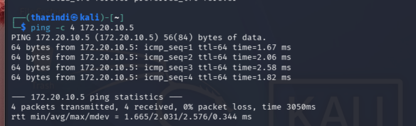

### Ubuntu SSH Failed Password Log

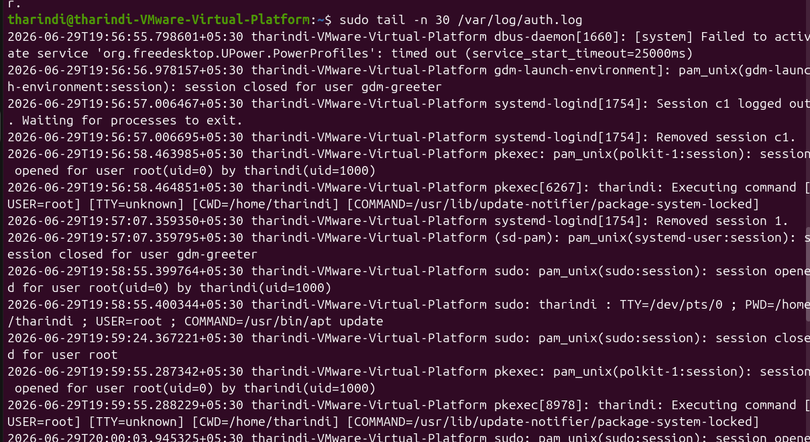

### Splunk Login Success

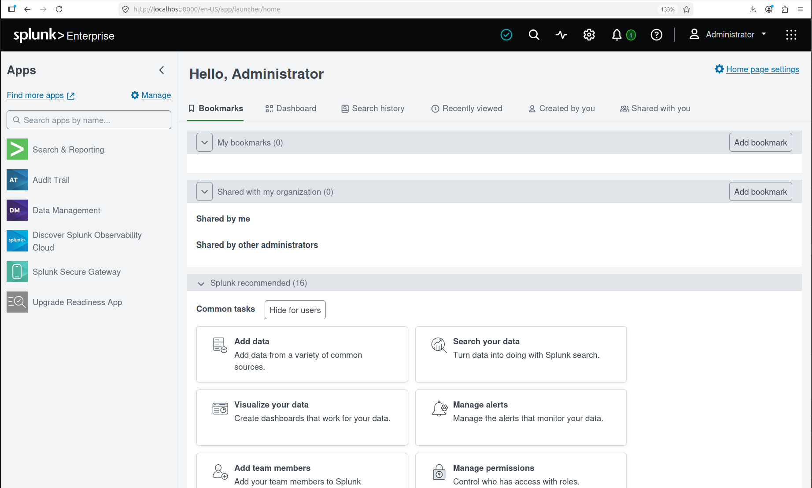

### Linux Auth Index Created

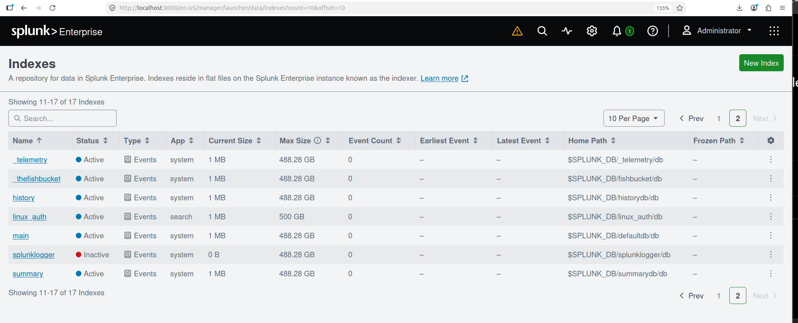

### Auth Log Added to Splunk

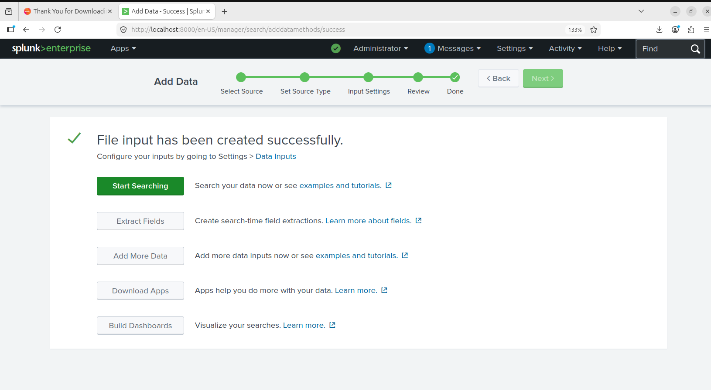

### Failed Password Search

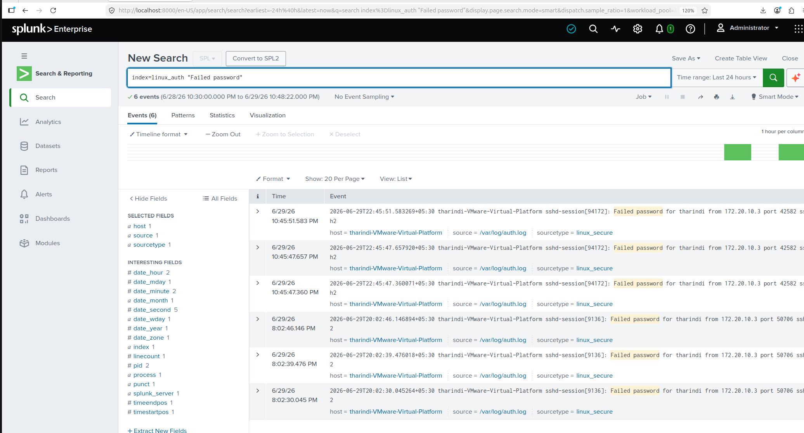

### Extracted SSH Fields

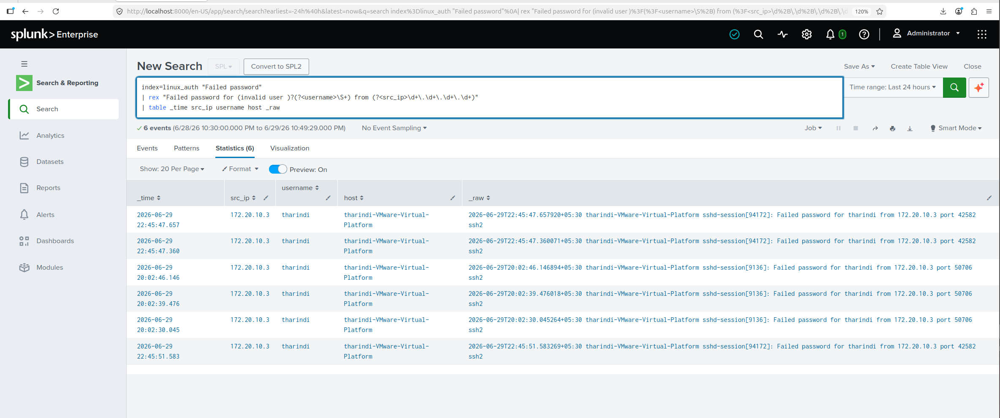

### Brute Force Detection Query

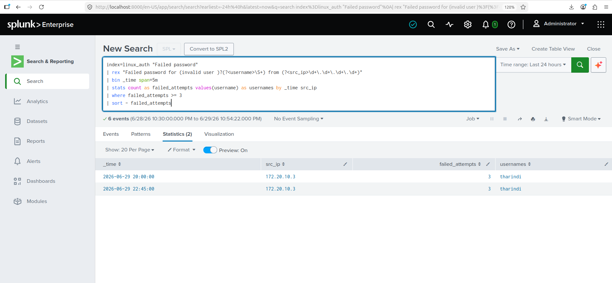

### Alert Created

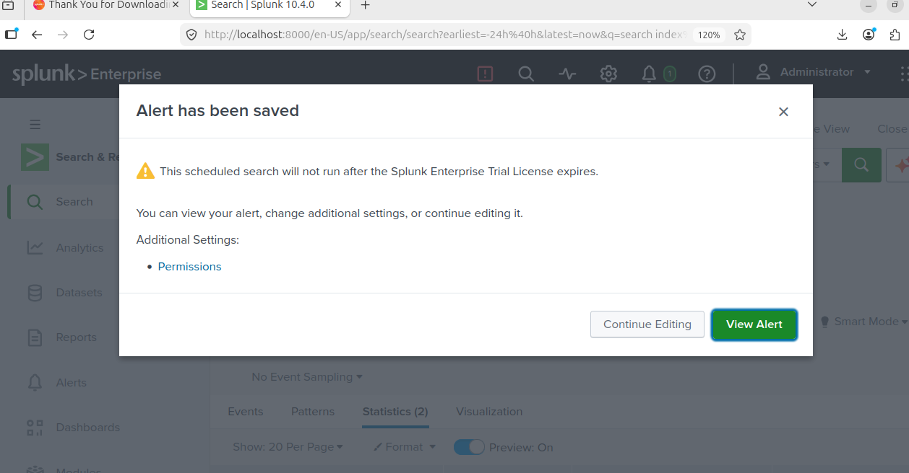

### Alert Triggered

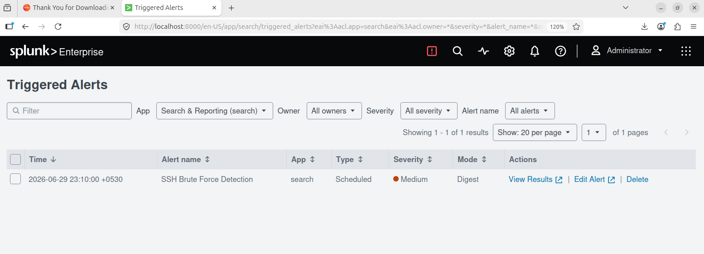

### Final Dashboard

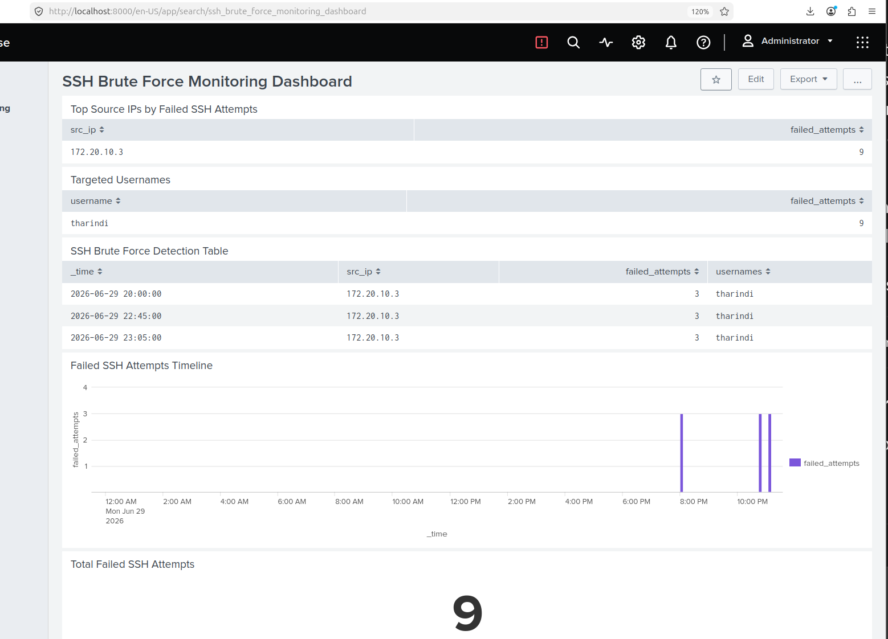

---

## Project Results

The lab successfully detected SSH brute-force behavior from the Kali Linux machine.

| Field               | Value                                |
| ------------------- | ------------------------------------ |
| Source IP           | `172.20.10.3`                        |
| Target Username     | `tharindi`                           |
| Failed Attempts     | `9`                                  |
| Detection Threshold | `3 failed attempts within 5 minutes` |
| Alert Status        | Successfully triggered               |

---

## MITRE ATT&CK Mapping

| Technique   | ID    | Description                                                                                      |
| ----------- | ----- | ------------------------------------------------------------------------------------------------ |
| Brute Force | T1110 | Adversaries may use brute-force techniques to gain access to accounts when passwords are unknown |

---

## Skills Demonstrated

* Linux log analysis
* SSH authentication monitoring
* Splunk data ingestion
* Custom Splunk index creation
* SPL query writing
* Field extraction using `rex`
* Detection logic development
* Scheduled alert creation
* Dashboard creation
* Basic SOC investigation workflow
* MITRE ATT&CK mapping

---

## Limitations

This project was created in a local lab environment with simulated activity. The detection threshold was intentionally low for testing purposes.

In a real environment, additional improvements would be needed, such as:

* Whitelisting trusted internal IP addresses
* Tuning thresholds to reduce false positives
* Detecting successful login after multiple failures
* Correlating SSH logs with firewall and network logs
* Adding threat intelligence enrichment

---

## Future Improvements

Possible future improvements include:

* Add detection for successful SSH login after multiple failed attempts
* Add port scan detection using Nmap logs, Zeek, or Suricata
* Integrate Wazuh for endpoint monitoring
* Create a full SOC dashboard with multiple detection use cases
* Export alerts into a report format

---

## Disclaimer

This lab was conducted in a controlled local virtual environment using only systems owned and configured for educational purposes. All testing was performed safely to demonstrate defensive security monitoring, detection engineering, and SOC analysis skills.

